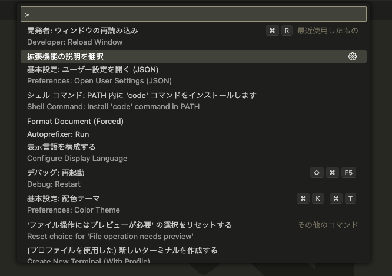
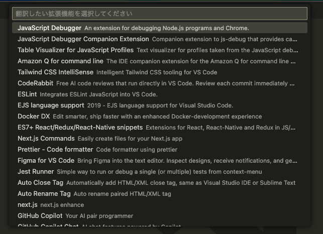
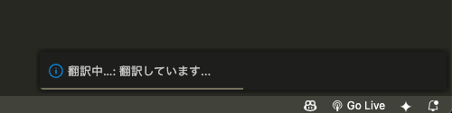
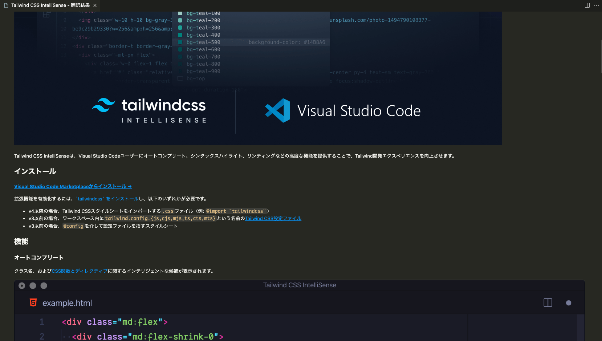

<div align="center">

# translate-vscode-extensions

VS Code拡張機能の説明文やREADMEを日本語へ自動翻訳し、見やすくプレビュー表示する拡張機能。

</div>

## 概要 (What)

英語で書かれた拡張機能の説明やREADMEの内容を、日本語にワンクリックで翻訳し、原文と並べて確認できます。コードブロックやリンクなどの構造は崩さず、安全にプレビュー表示します。

## 主な機能 (Features)

- 拡張機能の説明文と README.md を日本語に自動翻訳
- コードブロック/インラインコード/リンク/画像/HTML を保持した構造的な翻訳
- Webview 上で「原文」「翻訳」をタブ切替表示、拡張機能アイコン・バージョン表示に対応
- 外部リンクやローカルファイルリンクのクリックに対応（安全にオープン）
- Gemini 1.5 Flash による高品質翻訳（API Key 設定時）、未設定時は Google Translate を自動使用
- ファイルは変更せず、翻訳結果はプレビュー表示のみ

## 使い方 (Usage)

1. コマンドパレットを開く（macOS: Cmd+Shift+P / Windows/Linux: Ctrl+Shift+P）
2. 「拡張機能の説明を翻訳」を実行
3. 翻訳したい拡張機能を選択
4. Webview に原文/翻訳タブが表示されます

## 設定 (Configuration)

- 設定キー: `translateDescription.geminiApiKey`（任意）
  - 設定しない場合は Google Translate を使用します
  - 設定方法（例: settings.json）

```json
{
  "translateDescription.geminiApiKey": "YOUR_GEMINI_API_KEY"
}
```

- 取得手順: Google AI Studio で Gemini API Key を取得してください。
  - https://makersuite.google.com/app/apikey

## 必要要件 (Requirements)

- Visual Studio Code 1.104.0 以上
- インターネット接続（翻訳API利用のため）

## スクリーンショット (Screenshots)









## 注意事項

- 翻訳結果はプレビュー表示のみで、対象拡張機能やREADMEファイル自体は変更しません。
